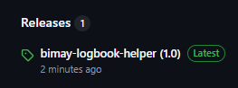
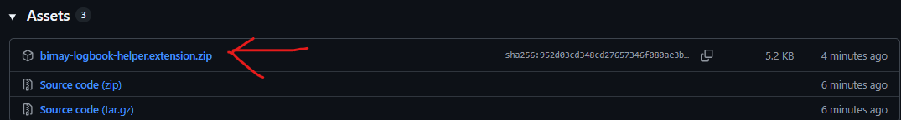
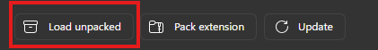
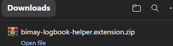

# bimay-logbook-helper

A simple Chrome extension that automates repetitive logbook entries.

Instead of manually filling each day one by one, Logbook Helper lets you select multiple dates and automatically fills in the Clock In, Clock Out, Activity, and Description fields.

> **Disclaimer**
>
> This is an unofficial productivity tool and is **not affiliated with, endorsed by, or supported by BINUS University or the Activity Enrichment system.**
> Use it at your own responsibility.

---

# Features

- Batch edit multiple logbook entries
- Select only the dates you want
- Supports both **Entry** and **Edit** entries
- Custom Clock In & Clock Out
- Custom Activity
- Custom Description
- Simple and lightweight

---

# Installation

## Step 1 - Download

Download or clone this repository.

Or download the latest release ZIP from the **Releases** page.






---

## Step 2 - Open Chrome Extensions

Open

```
chrome://extensions
```

---

## Step 3 - Enable Developer Mode

Turn on **Developer Mode** at the top-right corner.


---

## Step 4 - Load Unpacked

Click **Load unpacked**.




---

## Step 5 - Select the Extension Folder



Choose the extracted **Logbook Helper** folder.

> Select the folder that contains:

```
manifest.json
popup.html
popup.js
content.js
```


---

## Step 6 - Ready

Open the Activity Enrichment Logbook page and click the extension.


---

# Usage

1. Open the Activity Enrichment Logbook.
2. Open the **correct month** you want to edit.
3. Click the **Logbook Helper** extension.
4. Select the desired dates.
5. Enter:
   - Clock In
   - Clock Out
   - Activity
   - Description
6. Click **Run Selected**.
7. Wait until the automation completes.

---

# Notes

- ⚠️ The extension only works on the **currently opened month**. It does **not** switch between months automatically.
- ⚠️ During automation, some users may receive browser **alert dialogs** after submitting an entry. Simply click **OK** and the automation will continue.
- ⚠️ Do not refresh or close the page while the automation is running.
- ⚠️ Please verify the generated entries before submitting your monthly logbook.

---

# Supported Functions

- Batch Entry
- Batch Edit
- Multiple Date Selection
- Custom Clock In / Clock Out
- Custom Activity
- Custom Description

---

# Known Limitations

- Works only on the supported Activity Enrichment Logbook page.
- Requires the target month to be opened manually.
- Browser alerts must be acknowledged manually if they appear.

---

# Project Structure

```
LogbookHelper/
│
├── manifest.json
├── popup.html
├── popup.css
├── popup.js
├── content.js
├── icons/
├── screenshots/
└── README.md
```

---

# Contributing

Contributions, suggestions, and bug reports are welcome.

Feel free to open an Issue or submit a Pull Request.

---

# License

This project is licensed under the MIT License.

---

Made with ❤️ to reduce repetitive work.
